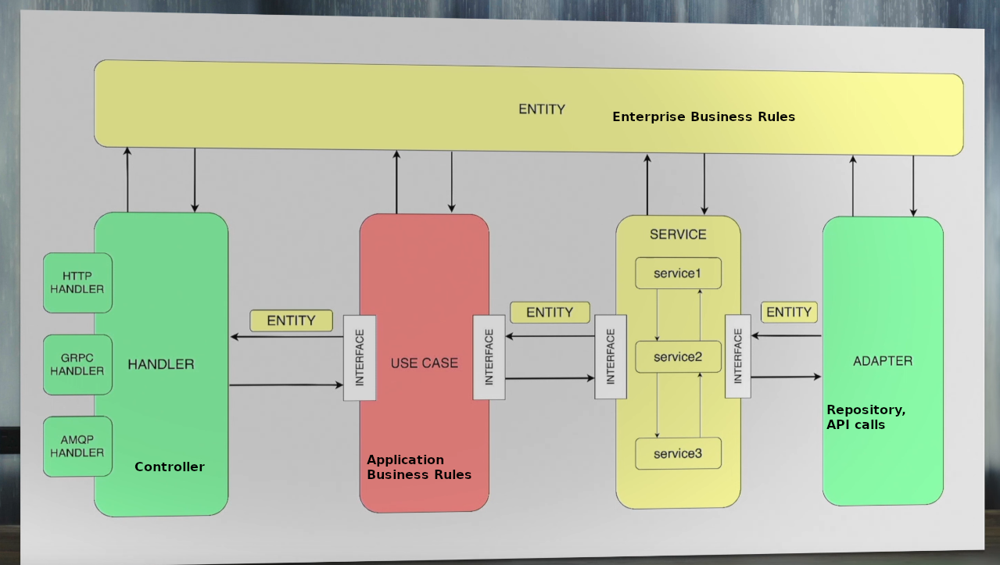

Sample Go Project per Clean Architecture

```
├── api - your api specs (swagger, protobuf etc.)
│   ├── v1 - version and particular specs inside
│   │   └── swagger.yaml
│   │
├── build - folder with docker files, docker-compose files and so on
│   ├── Dockerfile
│   └── ...
├── cmd  - folder with commands provided by your service
│   ├── command_name.go - service command implementation
│   └── ...
├── configs - service config files
│   ├── prod.conf.yaml
│   ├── local.conf.yaml
│   └── dev.conf.yaml
│
├── internal - folder for your internal package. Usually you write code here.
│   ├── app - App structure with bootstrapping, definitions and DI
│   │
│   ├── entity - service entity (they should be used globally through all layers as a data transmitters)
│   │
│   ├── service - list of our services with business logic. This layer interacts with adapter layer.
│   │
│   ├── usecase - usecase layer represent our service behaviour. It's describes all app features - interface for whole service.
│   │                 Use case orchestrate with services and aggregate service methods calls. It can be used only in handler layer.
│   ├── adapter - your infrastructure is here. Adapter folder contains packages for database connection, other http/grpc service clients, AMQP connections etc. ...
│   │   ├── webapi
│   │   ├── sqlrepository
│   │   └── ...
│   ├── config - you can find here a code for parsing and loading service configs
│   └── handler - our handlers - a layer to communicate with client. It describes our transport and request/response models.
│       ├── http - http protocol handler
│       │   ├── http.go - http server implementation
│       │   ├── router.go - base router implementation
│       │   └── api - package for service http API methods
│       │       └── v1
│       │           └── models - request/response methods (usually generated from swagger file)
│       │               ├── handler.go - api methods implementation
│       │               └── router.go  - api methods routing
│       ├── grpc - grpc protocol handlers
│       ├── amqp - amqp protocol handlers
│       └── ...
└── pkg - your public pkgs
```


